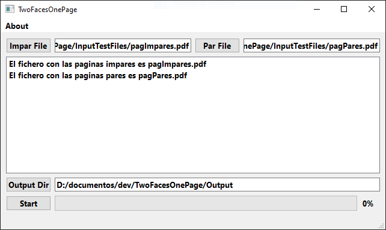

## TwoFacesOnePage

Si usted es poseedor de un escaner con alimentación automatica de documentos, pero solo escanea por una
cara.....
Esta aplicación le permite combinar dos archivos PDF escaneados en uno solo, de forma rápida y sencilla. 
Solo tienes que cargar un archivo con las páginas impares y otro con las páginas pares en orden inverso, 
y la aplicación generará automáticamente un PDF de salida, ordenado correctamente.

Icono proporcionado por [FreePik](https://www.freepik.es/).

## Licencia

Lee el fichero [LICENSE](LICENSE.txt) para ver derechos de licencia y limitaciones.

#### Por LeoCroms@2023 
